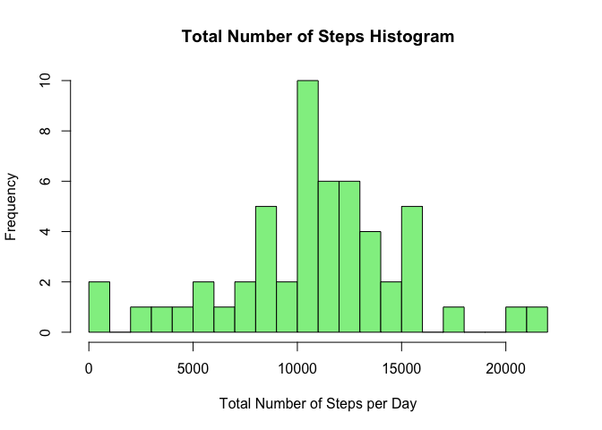
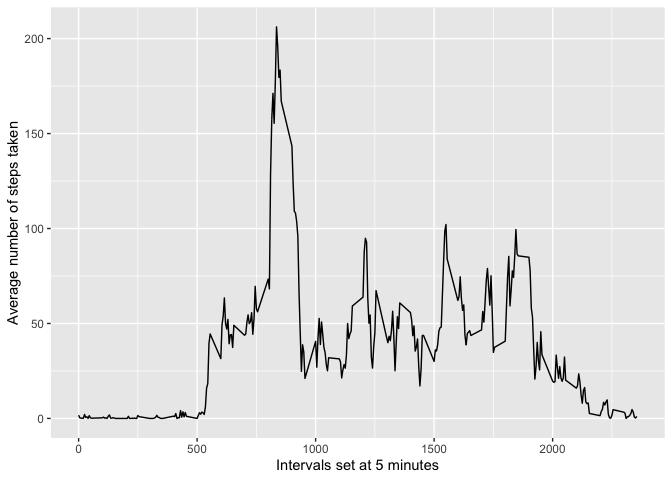
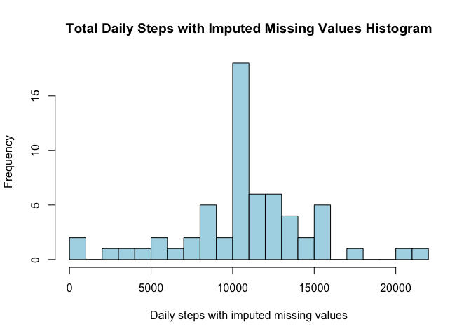
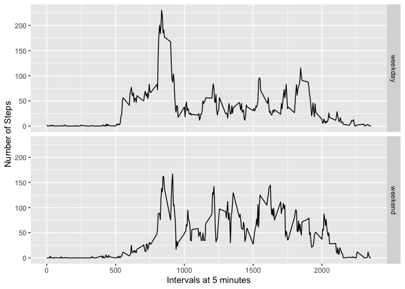

## Loading and preprocessing the data


```r
activity <- read.csv("activity.csv")

activity$date <- as.Date(activity$date, "%Y-%m-%d")
activity_df <- as.data.frame(activity)
df_activity <- subset(activity_df, !is.na(activity_df$steps))

dailysteps <- tapply(df_activity$steps, df_activity$date, sum, na.rm=TRUE, simplify=T)
dailysteps <- dailysteps[!is.na(dailysteps)]

hist(x=dailysteps,
     col="light green",
     breaks=20,
     xlab="Total Number of Steps per Day",
     ylab="Frequency",
     main="Total Number of Steps Histogram")
```

<!-- -->

## What is mean total number of steps taken per day?


```r
mean(dailysteps)
```

```
## [1] 10766.19
```

```r
median(dailysteps)
```

```
## [1] 10765
```

## What is the average daily activity pattern?


```r
library(ggplot2)

adp <- aggregate(x=list(steps=df_activity$steps), by=list(interval=df_activity$interval), FUN=mean)

ggplot(data=adp, aes(x=interval, y=steps)) + geom_line() + 
  xlab("Intervals set at 5 minutes") + ylab("Average number of steps taken")
```

<!-- -->

```r
adp[(which.max(adp$steps)),]
```

```
##     interval    steps
## 104      835 206.1698
```
## Imputing missing values


```r
sum(is.na(activity_df$steps))
```

```
## [1] 2304
```

```r
df_wmv <- activity_df
ndx <- is.na(df_wmv$steps)
int_avg <- tapply(df_activity$steps, df_activity$interval, mean, na.rm=TRUE, simplify=T)
df_wmv$steps[ndx] <- int_avg[as.character(df_wmv$interval[ndx])]

daily_total <- tapply(df_wmv$steps, df_wmv$date, sum, na.rm=TRUE, simplify=T)

hist(x=daily_total,
     col="Light Blue",
     breaks=20,
     xlab="Daily steps with imputed missing values",
     ylab="Frequency",
     main="Total Daily Steps with Imputed Missing Values Histogram")
```

<!-- -->

```r
mean(daily_total)
```

```
## [1] 10766.19
```

```r
median((daily_total))
```

```
## [1] 10766.19
```

## Are there differences in activity patterns between weekdays and weekends?

```r
library(ggplot2)
is_weekday <- function(d) {
    wd <- weekdays(d)
    ifelse (wd == "Saturday" | wd == "Sunday", "weekend", "weekday")
}

wx <- sapply(df_wmv$date, is_weekday)
df_wmv$wk <- as.factor(wx)
head(df_wmv)
```

```
##       steps       date interval      wk
## 1 1.7169811 2012-10-01        0 weekday
## 2 0.3396226 2012-10-01        5 weekday
## 3 0.1320755 2012-10-01       10 weekday
## 4 0.1509434 2012-10-01       15 weekday
## 5 0.0754717 2012-10-01       20 weekday
## 6 2.0943396 2012-10-01       25 weekday
```

```r
avg_df <- aggregate(steps ~ wk+interval, data=df_wmv, FUN=mean)
ggplot(avg_df, aes(interval, steps))+geom_line()+ facet_grid(wk ~ .) + xlab("Intervals at 5 minutes") + ylab("Number of Steps")
```

<!-- -->

